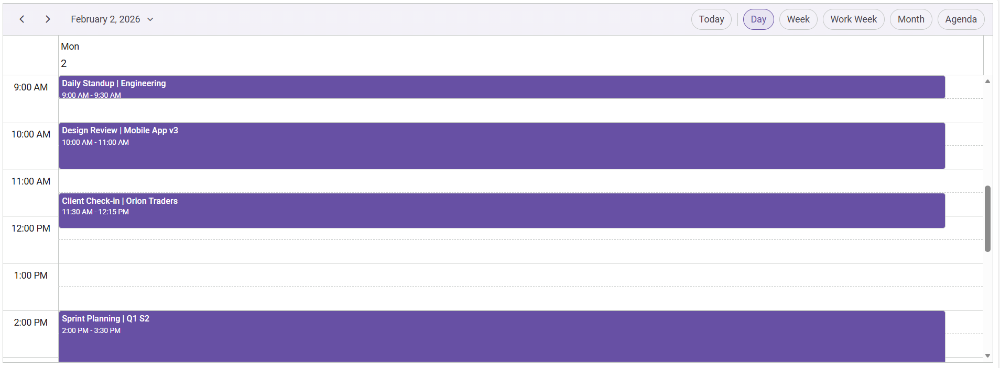

# Getting Started with Syncfusion React Scheduler using Vite (JavaScript)

## Description

This repository provides a quick starter example for integrating the Syncfusion React Scheduler component into a Vite + JavaScript application. It demonstrates the recommended setup flow: creating a Vite project, installing the Scheduler package, adding required Syncfusion styles, and rendering the Schedule component.

## Prerequisites
- Use Node Version 22 (LTS)

## Application Setup & Running the Project (Clone & Run)
  1. **Clone the repository to your local machine and navigate to the project folder.**
      ```bash
      git clone <repository-url>
      cd <project-folder>
      ```
  2. **Install project dependencies:**
      ```bash
      npm install
      ```
  3. **Start the application:**
      ```bash
      npm run dev
      ```
      Application started running on http://localhost:5173/

## Output Preview
**Syncfusion React Scheduler**

*Image illustrating the Syncfusion React Scheduler* 
